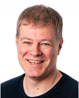
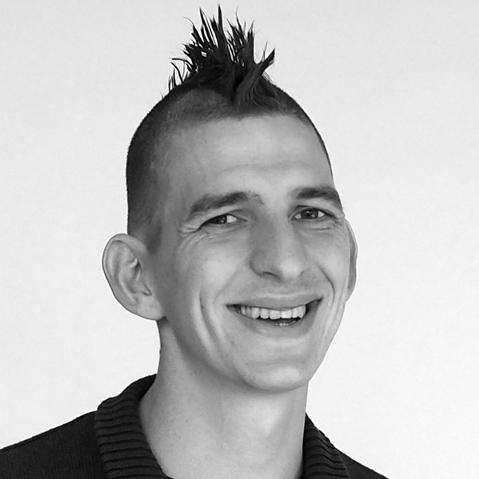
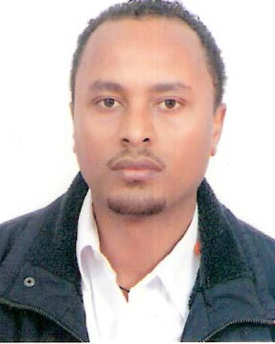
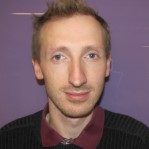
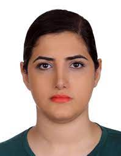
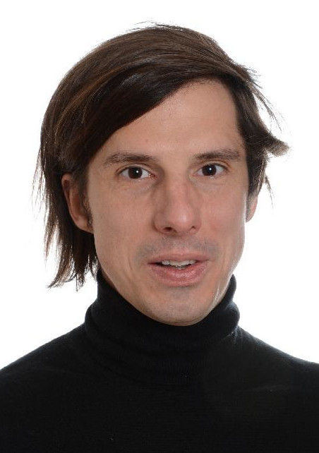

import '@/styles/home.css';

The Bergen node, ELIXIR@UiB, is located at the Computational Biology Unit (CBU) at the University of Bergen (UiB). CBU is an interdisciplinary research centre within the field of bioinformatics and computational biology and consists of groups from both natural and clinical sciences.
 
ELIXIR@UiB provides broad services of bio­informatics, mainly on high-throughput omics data analysis. That includes high-throughput sequencing data (i.e. Exome-seq, RNA-seq and ChIP-seq), gene expression microarrays and quantitative proteomics data­sets.
 
We also provide consulting on planning and design of high-throughput technology based experiments. The biological topics in focus are based on our collaborators’ research areas and these include medical research at Haukeland University Hospital, Bergen, and marine biology at the Department of Biology, UiB and the Marine Research Institute (IMR).
 
We further develop bioinformatics analysis infrastructure including e.g. Galaxy workflows as part of the Norwegian e-infrastructure for Life Science (NeLS), and host the NeLS core developer team. 
 
In addition, we are involved in developing solutions for handling and analysing sensitive omics data. This involves the participation of the Beyond 1+ Million Genome (B1+MG ) project through both Genome of Europe (GoE) and The Genomic Data Infrastructure (GDI).   
 
# **Head: Sushma Grellscheid**

||||||
:-:|:-:|:-:|:-:|:-:
  |  |  |  |

||||||
:-:|:-:|:-:|:-:|:-:
 |  |  |  | 

**From left to right, top to bottom:**

Sushma Grellscheid (**Head of Node**), Kjell Petersen (**Technical coordinator**), Ingeborg Winge (**Node coordinator**), Korbinian Bösl (**Data management coordinator**), Kidane Tekle (**NeLS**), David Dolan (**Helpdesk**), Siri Kallhovd (**Software Development**), Parisa Tejari Geravand (**Software Development**), Matúš Kalaš (**EDAM ontology**)

